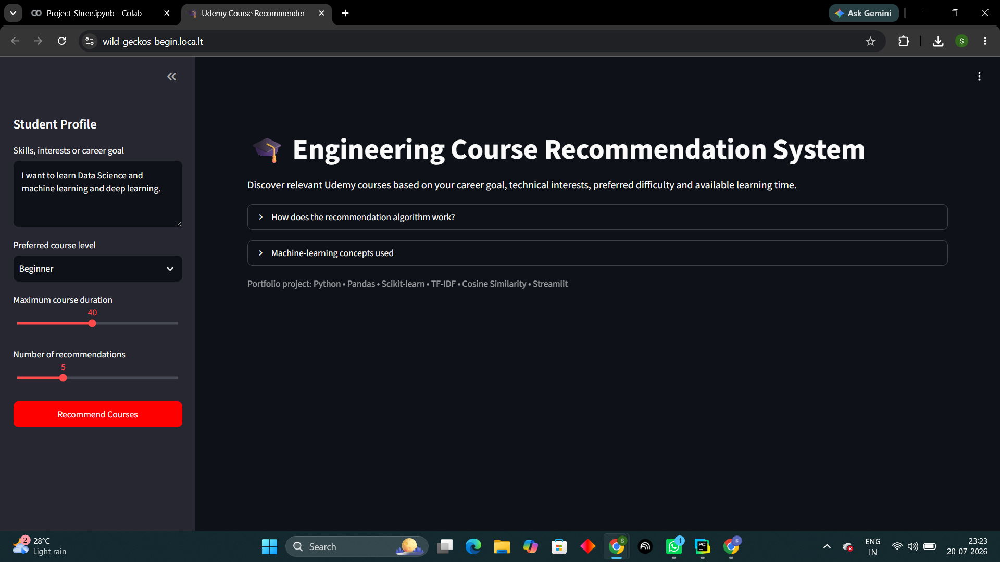
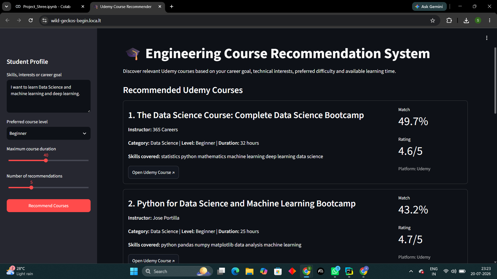
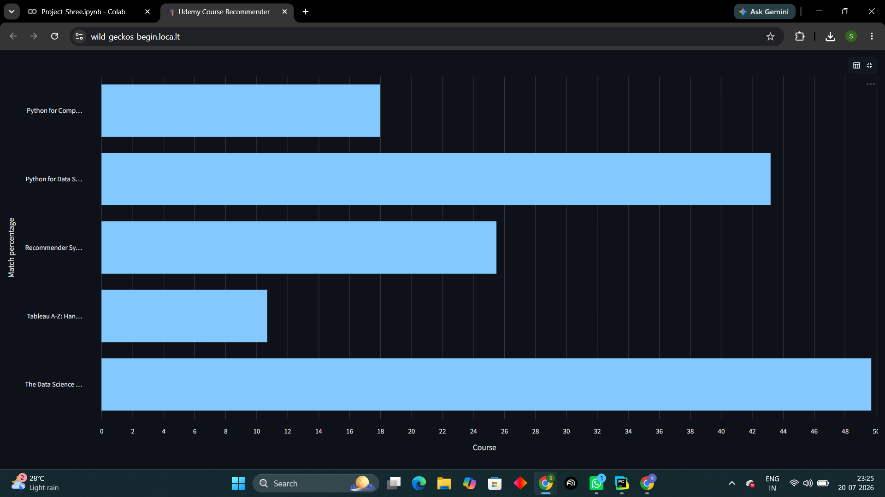

# 🎓 Udemy Course Recommender

An intelligent **Content-Based Recommendation System** that recommends Udemy courses based on a learner's interests, career goals, preferred difficulty level, and available learning time.

Instead of relying on previous user interactions, this project analyzes the textual content of courses using **TF-IDF Vectorization** and **Cosine Similarity** to generate personalized recommendations.

Developed using **Python, Scikit-learn, Pandas, and Streamlit** as part of a Data Science training project under the guidance of **Harshit Gaur**.

---

# 📸 Application Screenshots

Store all screenshots inside a folder named **screenshots/**.

```
screenshots/
│── home.png
│── recommendations.png
│── filters.png
│── chart.png
```

### 🏠 Home Page



---

### 🎯 Recommended Courses



---

### ⚙️ User Preferences


---

### 📊 Match Score Visualization



---

# 📖 Project Overview

With thousands of online courses available, choosing the right one can be difficult.

This project recommends courses by comparing a learner's interests with the textual information available for each course, including the course title, category, instructor, skills, and difficulty level.

Unlike collaborative filtering, this recommendation engine **does not require user history**, making it suitable for first-time users.

---

# ✨ Features

- 🎯 Personalized course recommendations
- 🔍 Content-Based Recommendation System
- 🧠 TF-IDF Vectorization
- 📊 Cosine Similarity Ranking
- 📚 Difficulty Level Filtering
- ⏳ Maximum Course Duration Filter
- ⭐ Rating-based Tie Breaking
- 📈 Interactive Match Score Visualization
- 🌐 Streamlit Web Application
- 🔗 Direct Links to Recommended Courses

---

# ⚙️ Methodology

### 1. Feature Engineering

Multiple course attributes are combined into a single textual feature:

- Course Name
- Category
- Skills
- Difficulty Level
- Instructor

This provides a richer representation of every course.

---

### 2. TF-IDF Vectorization

The combined course text is transformed into numerical vectors using **TfidfVectorizer** with unigrams and bigrams.

### Why TF-IDF?

Compared to Count Vectorization, TF-IDF:

- Reduces the importance of common words
- Highlights meaningful keywords
- Produces better similarity scores
- Improves recommendation quality

---

### 3. User Query Processing

The learner provides:

- Interests
- Career Goals
- Preferred Difficulty Level
- Maximum Learning Duration

The same TF-IDF vectorizer transforms the user query into a feature vector.

---

### 4. Similarity Calculation

Cosine Similarity measures how closely the user's interests match every course.

Each course receives a similarity score between 0 and 1.

---

### 5. Recommendation Ranking

Courses are ranked using:

- Cosine Similarity Score
- Difficulty Level Match
- Course Rating (tie breaker)

The highest-ranked courses are recommended to the learner.

---

# 🛠️ Tech Stack

| Technology | Purpose |
|------------|---------|
| Python | Programming Language |
| Pandas | Data Processing |
| Scikit-learn | TF-IDF & Cosine Similarity |
| Streamlit | Web Application |
| Matplotlib | Data Visualization |

---


# 📊 Machine Learning Concepts Demonstrated

- Content-Based Recommendation Systems
- Natural Language Processing (NLP)
- Text Vectorization
- TF-IDF (Term Frequency–Inverse Document Frequency)
- Cosine Similarity
- Feature Engineering
- Recommendation Ranking
- Interactive ML Deployment using Streamlit

---

# 💼 Technical Skills Demonstrated

- Converted unstructured text into numerical feature vectors using **TF-IDF**.
- Implemented **Cosine Similarity** for relevance-based recommendations.
- Performed feature engineering by combining multiple categorical and textual attributes.
- Built a complete **Content-Based Recommendation System** from data preprocessing to deployment.
- Developed and deployed an interactive machine learning application using **Streamlit**.
- Applied ranking and filtering techniques to improve recommendation quality.

---

# 📈 Future Improvements

- Hybrid Recommendation System
- Semantic Search using Sentence Transformers
- Personalized User Profiles
- Recommendation History
- Collaborative Filtering Integration
- Advanced Search Filters
- Course Bookmarking
- Multi-language Support

---

# 🙏 Acknowledgements

This project was developed under the mentorship of **Harshit Gaur** as part of a Data Science Training Program.

Special thanks to the open-source community and the developers of **Scikit-learn**, **Pandas**, and **Streamlit**.

---

# 📜 License

This project is open-source and intended for educational and learning purposes.

---

## Connect With Me

**Shree Sharma**

LinkedIn: *(https://www.linkedin.com/in/shree-sharma-8b879a324?utm_source=share_via&utm_content=profile&utm_medium=member_android)*


---


## ⭐ If you found this project interesting, consider giving it a star!

📄 License

This project is open source and available for learning purposes.
